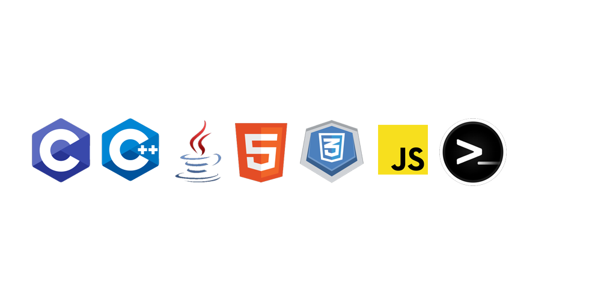

<!--
**IvanitiX/IvanitiX** is a ✨ _special_ ✨ repository because its `README.md` (this file) appears on your GitHub profile.

Here are some ideas to get you started:

- 🔭 I’m currently working on ...
- 🌱 I’m currently learning ...
- 👯 I’m looking to collaborate on ...
- 🤔 I’m looking for help with ...
- 💬 Ask me about ...
- 📫 How to reach me: ...
- 😄 Pronouns: ...
- ⚡ Fun fact: ...
-->

# ¡Hey, hola!
Soy Iván, un estudiante de Ingeniería Informática en la Universidad de Granada. (Y a veces juego videojuegos mientras transmito por Twitch)

## ¿Qué puedo encontrar entre las repos?
Suelo usar GitHub para los trabajos de la Uni pero a veces programo por mi cuenta (si me apetece y no me mancillan a tareas).

¿Necesitas mirar algo porque te cuesta alguna práctica? ¡Adelante, echa un vistazo! (Pero no hagas una copia descarada oye)

También tengo por ahí un prototipo de chatbot para Twitch y un juego que me moló tanto que lo puse para jugar [aquí](https://ivanitix.github.io/DROM)

## ¿Qué lenguajes has manejado?

